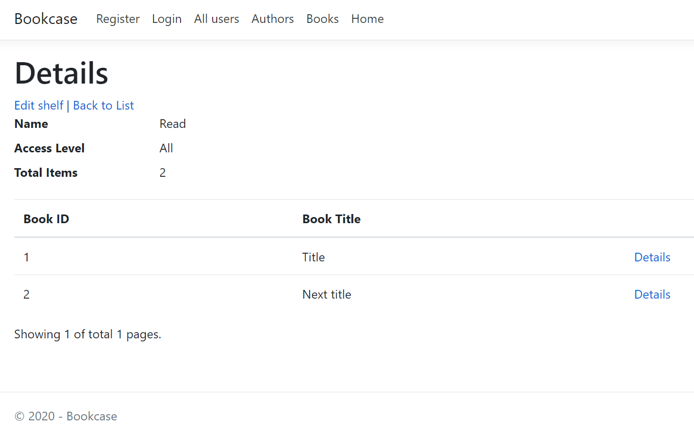

# Bookcase
This is a pet project to practice building .NET Core application based on a simplified microservices architecture and Docker containers.

The application provides books/authors catalog, and service to create your own book collections called shelves.

## Used technologies
.NET Core 3, ASP.NET Core (Web API, MVC, gRPC), EF Core, SQL Server, MongoDB, RabbitMQ, Docker.

## Architecture overview
The architecture proposes a microservice oriented architecture implementation with autonomous microservices. There are 3 microservices based on ASP.NET Core Web API, and 1 web application based on ASP.NET Core MVC. 

Microservices are implemented as a simple CRUD. Data is stored in SQL Server and MongoDB databases. Microservices list:
- "Catalog" is responsible for books/authors catalog.
- "Identity" is responsible for authentication/authorization.
- “Shelves” is responsible for users' owned book collections.

MVC communicates with microservices using HTTP protocol. The communication is based on gRPC and REST API using JSON format.

Bookcase includes simplified Event Bus abstraction to handle integration events. The implementation based on RabbitMQ.

For simplification, unit test covers only Catalog.API partly.

## Getting started
You have to install Visual Studio 2019 with .NET Core cross-platform development workload.
To build and run the application with F5 or Ctrl + F5, the “docker-compose” project has to be set as the default startup project.

### Related links:
- https://host.docker.internal/ - MVC
- http://host.docker.internal:8080/ - IdentityServer4
- http://host.docker.internal:5200/swagger/index.html - Swagger UI for Catalog.API
- http://host.docker.internal:5201/swagger/index.html - Swagger UI for Shelves.API
- http://host.docker.internal:15672/ - RabbitMQ Management UI

## Next to be implemented
The next features to be implemented:
- TBD.

## Example of the shelve page

